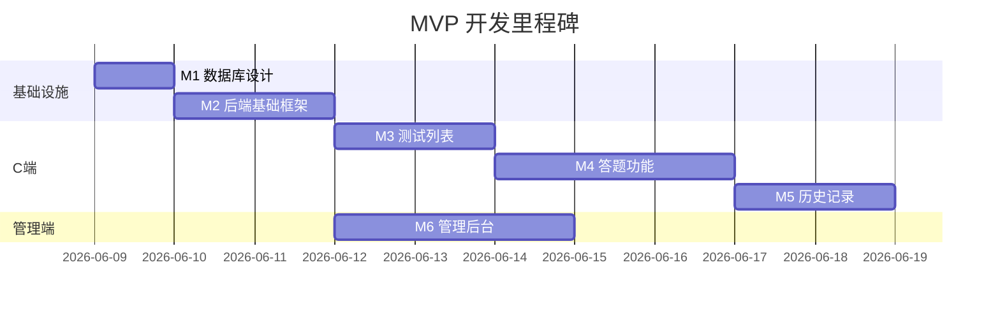

# 开发里程碑

> 版本：v1.3  
> 状态：M1–M5 后端已完成  
> 更新日期：2026-06-06

每个 Milestone 预估 **1–3 天**。总计约 **12–16 个工作日**。

---

## 里程碑总览

| 编号 | 名称 | 预估 | 依赖 | 状态 |
|------|------|------|------|------|
| M1 | 数据库设计 | 1 天 | — | ✅ 已完成 |
| M2 | 后端基础框架 | 2 天 | M1 | ✅ 已完成 |
| M3 | 测试列表 | 2 天 | M2 | ✅ 已完成 |
| M4 | 答题功能 | 3 天 | M3 | ✅ 已完成 |
| M5 | 历史记录 | 2 天 | M4 | ✅ 已完成（后端） |
| M6 | 管理后台 | 3 天 | M2（可与 M3–M5 部分并行） | 待开始 |



---

## M1 数据库设计（1 天）✅

### 目标

完成数据库落地，字段与 `schema.md` 完全一致。

### 任务清单

| 任务 | 产出 |
|------|------|
| 编写 8 张表 DDL | `user`、`admin_user`、`quiz`、`question`、`option`、`result_rule`、`test_attempt`、`answer` |
| 创建本地 MySQL 库 | `psych_miniapp` |
| 初始化管理员账号 | 1 条 `admin_user` |
| 验证约束 | 含 `quiz.cover_image_url`、`quiz.deleted_at`、`test_attempt` 快照字段（含 `result_suggestion`） |

### 验收标准

- [x] 字段与 `schema.md` v1.2 一致
- [x] `test_attempt` 含 `quiz_title`、`result_title`、`result_description`、`result_suggestion`
- [x] `quiz` 含 `cover_image_url`、`deleted_at`
- [x] 唯一约束生效：`user.openid`、`admin_user.username`、`answer(attempt_id, question_id)`

**产出：** `backend/src/main/resources/db/init.sql`

### 涉及文档

- `schema.md`

---

## M2 后端基础框架（2 天）✅

### 目标

搭建 Spring Boot 3 项目骨架，完成简单认证与统一响应，使后续业务接口可直接开发。

### 任务清单

| 任务 | 产出 |
|------|------|
| 初始化 Spring Boot 3 项目（Java 17, Maven） | 可启动项目 |
| 配置 MySQL 数据源与持久层（MyBatis 或 JPA，择一） | 数据库连通 |
| 实现统一响应体 | 与 `api.md` 格式一致 |
| 实现全局异常处理 | 错误码与 `api.md` 一致 |
| 实现 C 端微信登录 | `POST /api/auth/wechat/login` |
| 实现管理端简单登录 | `POST /api/admin/auth/login`，校验单一 `admin_user` |
| 实现简单 Token 鉴权 | 内存 Token 存储，拦截器校验，**不使用 JWT** |
| 配置 CORS | 管理端本地联调 |
| 微信 mock 模式 | 本地无 AppSecret 时可开发 |

### 验收标准

- [x] `mvn spring-boot:run` 本地启动成功
- [x] MySQL + MyBatis-Plus 持久层连通
- [x] 统一响应体 `Result<T>` 与 `api.md` 一致
- [x] 全局异常处理（`BizException`、`MethodArgumentNotValidException` → `40001`）
- [x] CORS 本地配置（`WebMvcConfig`）
- [ ] C 端登录返回简单 Token，`openid` 自动写入 `user` 表（待后续接入）
- [ ] 管理端登录校验单一管理员账号，返回简单 Token（待 M6）
- [ ] 未携带有效 Token 访问受保护接口返回 40101（待后续接入）
- [ ] C 端 Token 与管理端 Token 互不通用（待后续接入）

**M4/M5 联调说明：** C 端接口暂用固定测试用户 `user_id = 1`（`seed.sql` 中 `openid = mock-openid`），不依赖 Token。

### 涉及接口

- `POST /api/auth/wechat/login`（待实现）
- `POST /api/admin/auth/login`（待实现）

### 涉及文档

- `api.md` §1、§2.1、§3.1
- `architecture.md` §6（Auth 模块）

---

## M3 测试列表（2 天）✅

### 目标

C 端可浏览已上架测试及详情页；管理端可创建和管理测试基本信息。

### 任务清单

**后端：**

| 任务 | 接口 |
|------|------|
| C 端测试列表 | `GET /api/quizzes` |
| C 端测试详情 | `GET /api/quizzes/{quizId}` |
| 管理端测试列表 | `GET /api/admin/quizzes` |
| 创建测试 | `POST /api/admin/quizzes` |
| 管理端测试详情 | `GET /api/admin/quizzes/{quizId}` |
| 更新基本信息 | `PUT /api/admin/quizzes/{quizId}` |
| 软删除 | `DELETE /api/admin/quizzes/{quizId}` |

**小程序：**

| 任务 | 页面 |
|------|------|
| 启动登录 | `app.js` |
| 首页列表 | `pages/index` |
| 测试详情页 | `pages/quiz-detail` |
| 请求封装 | `utils/request.js` |

**管理端（最小可用）：**

| 任务 | 页面 |
|------|------|
| 登录页 | `/login` |
| 测试列表 + 创建 | `/quizzes` |

### 验收标准

**后端（已实现）：**

- [x] `GET /api/quizzes` 返回已上架、未删除测试（含 `coverImageUrl`）
- [x] `GET /api/quizzes/{quizId}` 返回完整详情
- [x] 软删除或未上架测试 C 端返回 `40401`

**前端 / 管理端（待 M6 或独立迭代）：**

- [ ] 小程序首页列表与测试详情页
- [ ] 管理端测试 CRUD

**产出：** `QuizController`、`QuizService`、`seed.sql`

### 涉及文档

- `requirements.md` §3.2、§3.3、§4.2
- `api.md` §2.2、§2.3、§3.2–§3.6

---

## M4 答题功能（3 天）✅

### 目标

完成答题链路：拉题 → 一题一屏 → `POST /api/attempts` 提交 → 直接拿结果对象展示。

### 任务清单

**后端：**

| 任务 | 接口 |
|------|------|
| 获取题目（不含分值） | `GET /api/quizzes/{quizId}/questions` |
| 提交答案 | `POST /api/attempts` |
| 总分计分 + 规则匹配 | 仅提交时执行一次 |
| 快照写入 | `quiz_title`、`result_title`、`result_description`、`result_suggestion` |
| 上架 / 下架 | `publish` / `unpublish`（待 M6） |
| 题目 / 选项 / 规则 CRUD | 管理端接口（待 M6） |

**小程序：**

| 任务 | 说明 |
|------|------|
| 答题页一题一屏 | 进度、必答校验 |
| 提交后直接用响应渲染结果页 | 无需二次请求 |
| 中途退出丢弃 | 不用本地存储 |

### 验收标准

**后端（已实现并通过联调）：**

- [x] `GET /api/quizzes/{quizId}/questions` 返回题目与选项，**不含** `score`
- [x] `POST /api/attempts` 请求体含 `quizId` + `answers`，响应为 `AttemptResult`
- [x] 总分计分：`total_score = Σ(option.score)`
- [x] `result_rule` 闭区间唯一匹配（0 条 / 多条 → `42201`）
- [x] 快照字段写入 `test_attempt`（含 `result_suggestion`）
- [x] `answer` 记录同事务写入，`answer.score` 为选项分值快照
- [x] 业务校验：必答全部题、选项归属题目、题目归属测试
- [x] 异常场景：`40401`、`40001`、`42201` 已验证

**前端 / 管理端（待后续）：**

- [ ] 小程序答题页一题一屏与结果页
- [ ] 上架前规则覆盖校验（`QuizPublishValidator`，待 M6）

**产出：** `AttemptController`、`AttemptService`、`ScoringService`；测试数据统一在 `seed.sql`

### 涉及文档

- `requirements.md` §3.4、§3.5、§5
- `schema.md` §3.6、§3.7
- `api.md` §2.4、§2.5、§3.7–§3.17
- `architecture.md` §8.2（Attempt / Scoring 调用链）

---

## M5 历史记录（2 天）✅

### 目标

用户可查看答题历史；详情只读快照，不重新计分。

### 任务清单

**后端：**

| 任务 | 接口 |
|------|------|
| 历史列表 | `GET /api/attempts` |
| 历史详情 | `GET /api/attempts/{attemptId}` |
| 快照直读 | 禁止调用 `ScoringService` / 规则匹配 |
| 归属校验 | 不存在或非本人 → `40401`（MVP 不区分 `40301`） |

**小程序：**

| 任务 | 页面 |
|------|------|
| 历史列表 | `pages/history` |
| 历史详情 | 复用结果页或 `pages/history-detail` |

### 验收标准

**后端（已实现）：**

- [x] 列表返回 `List<AttemptListItemResponse>`，字段来自 `test_attempt` 快照（MVP 无分页）
- [x] 详情不重新计分、不重新匹配规则；`listByUser` / `getDetail` 不调用 `ScoringService`
- [x] 结果区读 `test_attempt` 快照；`answer.score` 读快照；`questionContent` / `optionContent` 读当前 `question` / `option`
- [x] 不存在或非本人记录均返回 `40401`
- [x] 无删除接口

**联调验证（需 POST 造数）：**

- [ ] 修改 `result_rule` 后，旧历史结果区仍显示原快照
- [ ] 测试软删除后，历史仍可通过 `quiz_title` 快照正常展示

**前端（待后续）：**

- [ ] 小程序历史列表与详情页

**产出：** `AttemptListItemResponse`、`AttemptDetailResponse`、`AnswerDetailResponse`；`seed.sql` 合并 M3/M4 数据

### 测试数据

```bash
mysql < backend/src/main/resources/db/init.sql
mysql < backend/src/main/resources/db/seed.sql
# 历史记录通过 POST /api/attempts 生成
```

### 涉及文档

- `requirements.md` §3.6
- `api.md` §2.6、§2.7
- `architecture.md` §8.4（M5 调用链）

---

## M6 管理后台（3 天）

### 目标

完善 React Admin，在测试详情页内管理题目/选项/规则，录入并上架 3 个测试。

### 任务清单

| 任务 | 说明 |
|------|------|
| 测试详情页 Tab 布局 | 基本信息 / 题目 / 结果规则 |
| 题目与选项管理 | 含分值、排序 |
| 结果规则管理 | 总分区间，展示 `scoreRange` |
| 上架前校验提示 | 前后端错误展示 |
| 软删除确认 | 二次确认弹窗 |
| 录入 3 个测试 | 压力自测、情绪自测、性格倾向（暂定） |

### 验收标准

- [ ] 单管理员账号登录全流程通畅
- [ ] 测试详情页内完成题目、选项、规则配置
- [ ] 3 个测试全部上架，C 端可完整作答
- [ ] `coverImageUrl` 可填写或留空

### 涉及文档

- `requirements.md` §4.3、§6.1
- `api.md` §3 全部

---

## MVP 完成定义

| 检查项 | 标准 |
|--------|------|
| C 端流程 | 登录 → 列表 → 详情 → 答题 → 提交拿结果 → 历史 |
| 管理端流程 | 单账号登录 → 创建 → 配置 → 上架 |
| 计分 | 仅总分区间，仅提交时计算 |
| 快照 | 历史只读快照，不重算 |
| 认证 | 简单 Token，无 JWT |
| 文档 | requirements、schema、api、milestone、architecture 与实现一致 |

---

## 风险与注意事项

| 风险 | 应对 |
|------|------|
| 微信 AppSecret 本地不可用 | mock 登录开关 |
| 结果规则配置错误 | 展示 `scoreRange` + 上架校验 |
| 服务重启 Token 失效 | MVP 可接受，用户重新登录 |
| M6 与 M3/M4 重叠 | M3/M4 先做最小可用，M6 统一打磨 |
| M4 阶段无 Token | 固定 `user_id = 1` 联调；微信登录接入后替换 `AttemptController` 取 userId 方式 |
