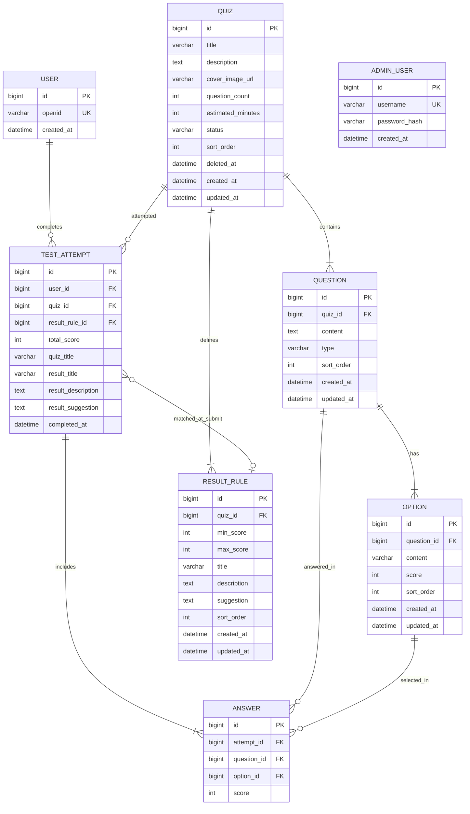

# 数据库实体设计

> 版本：v1.2  
> 状态：已与 M4 实现对齐  
> 更新日期：2026-06-06

本文档描述 MVP 第一版所有数据库实体、字段及关系。不包含建表 SQL。

**计分约束：** MVP 仅支持总分区间计分（`result_rule.min_score` / `max_score`），不支持多维度计分。

---

## 1. 实体总览

| 实体 | 表名（建议） | 说明 |
|------|-------------|------|
| 用户 | `user` | C 端微信用户，以 openid 标识 |
| 管理员 | `admin_user` | 管理端单一账号 |
| 测试 | `quiz` | 心理自测问卷 |
| 题目 | `question` | 测试下的题目 |
| 选项 | `option` | 题目下的选项，含分值 |
| 结果规则 | `result_rule` | 总分区间与结果文案 |
| 答题记录 | `test_attempt` | 用户一次完整作答，含结果快照 |
| 单题作答 | `answer` | 答题记录中每道题的选择 |

共 8 张表。

---

## 2. ER 关系



---

## 3. 实体字段详述

### 3.1 `user` — C 端用户

| 字段 | 类型 | 约束 | 说明 |
|------|------|------|------|
| id | BIGINT | PK, 自增 | 主键 |
| openid | VARCHAR(64) | NOT NULL, UNIQUE | 微信用户唯一标识 |
| created_at | DATETIME | NOT NULL | 首次登录时间 |

**说明：**
- 不存储昵称、头像、unionid
- 用户通过 `wx.login` 的 `code` 在后端首次换票时自动创建

---

### 3.2 `admin_user` — 管理员

| 字段 | 类型 | 约束 | 说明 |
|------|------|------|------|
| id | BIGINT | PK, 自增 | 主键 |
| username | VARCHAR(50) | NOT NULL, UNIQUE | 登录用户名 |
| password_hash | VARCHAR(255) | NOT NULL | 密码哈希（如 BCrypt） |
| created_at | DATETIME | NOT NULL | 账号创建时间 |

**说明：**
- MVP 仅一个管理员账号，通过初始化数据插入
- 不单独建角色/权限表

---

### 3.3 `quiz` — 测试

| 字段 | 类型 | 约束 | 说明 |
|------|------|------|------|
| id | BIGINT | PK, 自增 | 主键 |
| title | VARCHAR(100) | NOT NULL | 测试标题 |
| description | TEXT | NOT NULL | 测试简介 |
| cover_image_url | VARCHAR(500) | NULL | 封面图 URL，MVP 可留空 |
| question_count | INT | NOT NULL, DEFAULT 0 | 题目数量（冗余，便于列表展示） |
| estimated_minutes | INT | NOT NULL, DEFAULT 5 | 预计完成时长（分钟） |
| status | VARCHAR(20) | NOT NULL | 状态，见下方枚举 |
| sort_order | INT | NOT NULL, DEFAULT 0 | 排序权重，越小越靠前 |
| deleted_at | DATETIME | NULL | 软删除时间，NULL 表示未删除 |
| created_at | DATETIME | NOT NULL | 创建时间 |
| updated_at | DATETIME | NOT NULL | 最后更新时间 |

**`status` 枚举：**

| 值 | 说明 | C 端可见 |
|----|------|----------|
| `draft` | 草稿，配置中 | 否 |
| `published` | 已上架 | 是（且 `deleted_at` 为 NULL） |
| `archived` | 已下架 | 否 |

**软删除规则：**
- 调用删除接口时写入 `deleted_at`，不物理删除
- 软删除后 C 端不可见，管理端列表可展示并标注「已删除」
- 历史记录通过 `test_attempt.quiz_title` 快照保持可读

**索引建议：**
- `(status, deleted_at, sort_order)` — C 端列表查询

---

### 3.4 `question` — 题目

| 字段 | 类型 | 约束 | 说明 |
|------|------|------|------|
| id | BIGINT | PK, 自增 | 主键 |
| quiz_id | BIGINT | NOT NULL, FK → quiz.id | 所属测试 |
| content | TEXT | NOT NULL | 题干内容 |
| type | VARCHAR(20) | NOT NULL | 题型，MVP 固定 `single_choice` |
| sort_order | INT | NOT NULL, DEFAULT 0 | 题目顺序 |
| created_at | DATETIME | NOT NULL | 创建时间 |
| updated_at | DATETIME | NOT NULL | 最后更新时间 |

**索引建议：** `(quiz_id, sort_order)`

---

### 3.5 `option` — 选项

| 字段 | 类型 | 约束 | 说明 |
|------|------|------|------|
| id | BIGINT | PK, 自增 | 主键 |
| question_id | BIGINT | NOT NULL, FK → question.id | 所属题目 |
| content | VARCHAR(500) | NOT NULL | 选项文本 |
| score | INT | NOT NULL, DEFAULT 0 | 选项分值，参与总分累加 |
| sort_order | INT | NOT NULL, DEFAULT 0 | 选项顺序 |
| created_at | DATETIME | NOT NULL | 创建时间 |
| updated_at | DATETIME | NOT NULL | 最后更新时间 |

**说明：**
- 每题至少 2 个选项
- MVP 计分方式：`total_score = Σ(option.score)`

**索引建议：** `(question_id, sort_order)`

---

### 3.6 `result_rule` — 结果规则

| 字段 | 类型 | 约束 | 说明 |
|------|------|------|------|
| id | BIGINT | PK, 自增 | 主键 |
| quiz_id | BIGINT | NOT NULL, FK → quiz.id | 所属测试 |
| min_score | INT | NOT NULL | 总分下限（含） |
| max_score | INT | NOT NULL | 总分上限（含） |
| title | VARCHAR(100) | NOT NULL | 结果标题 |
| description | TEXT | NOT NULL | 结果解读正文 |
| suggestion | TEXT | NULL | 结果建议，供结果页展示行动提示，可为空 |
| sort_order | INT | NOT NULL, DEFAULT 0 | 展示排序 |
| created_at | DATETIME | NOT NULL | 创建时间 |
| updated_at | DATETIME | NOT NULL | 最后更新时间 |

**业务约束（总分区间计分）：**
- 同一 `quiz_id` 下区间不得重叠
- 上架时须覆盖所有可能总分范围
- 提交时按 `total_score` 命中唯一规则，将 `title`、`description`、`suggestion` 写入 `test_attempt` 快照

**索引建议：** `(quiz_id, min_score, max_score)`

---

### 3.7 `test_attempt` — 答题记录

| 字段 | 类型 | 约束 | 说明 |
|------|------|------|------|
| id | BIGINT | PK, 自增 | 主键 |
| user_id | BIGINT | NOT NULL, FK → user.id | 答题用户 |
| quiz_id | BIGINT | NOT NULL, FK → quiz.id | 所做测试 |
| result_rule_id | BIGINT | NULL, FK → result_rule.id | 提交时命中的规则 ID（追溯用） |
| total_score | INT | NOT NULL | 本次答题总分（提交时计算并持久化） |
| quiz_title | VARCHAR(100) | NOT NULL | 测试标题快照 |
| result_title | VARCHAR(100) | NOT NULL | 结果标题快照 |
| result_description | TEXT | NOT NULL | 结果描述快照 |
| result_suggestion | TEXT | NULL | 结果建议快照，提交时从 `result_rule.suggestion` 写入 |
| completed_at | DATETIME | NOT NULL | 完成时间 |

**快照策略：**
- 提交时一次性写入 `quiz_title`、`result_title`、`result_description`、`result_suggestion`、`total_score`
- 历史查询（`GET /api/attempts/{attemptId}`）**直接读取本表字段**，不重新计分、不重新匹配规则
- 不提供删除接口，记录永久保留

**API 字段对应（M4 已验证）：**

| DB 列 | API 响应字段 | 写入来源 |
|-------|-------------|----------|
| `quiz_title` | `quizTitle` | `quiz.title` |
| `result_title` | `resultTitle` | `result_rule.title` |
| `result_description` | `resultDescription` | `result_rule.description` |
| `result_suggestion` | `resultSuggestion` | `result_rule.suggestion`（可为 NULL） |
| `total_score` | `totalScore` | 提交时 `Σ(option.score)` |

**索引建议：** `(user_id, completed_at DESC)`

---

### 3.8 `answer` — 单题作答

| 字段 | 类型 | 约束 | 说明 |
|------|------|------|------|
| id | BIGINT | PK, 自增 | 主键 |
| attempt_id | BIGINT | NOT NULL, FK → test_attempt.id | 所属答题记录 |
| question_id | BIGINT | NOT NULL, FK → question.id | 题目 |
| option_id | BIGINT | NOT NULL, FK → option.id | 所选选项 |
| score | INT | NOT NULL | 该题得分（提交时从 option.score 写入） |

**说明：**
- 每道题在一条 `test_attempt` 中只有一条 `answer`
- 历史详情中 `score` 直接读取本表，不重算

**索引建议：**
- `(attempt_id)`
- UNIQUE `(attempt_id, question_id)`

---

## 4. 实体关系说明

| 关系 | 类型 | 说明 |
|------|------|------|
| quiz → question | 1:N | 一个测试多道题目 |
| question → option | 1:N | 一道题目多个选项 |
| quiz → result_rule | 1:N | 一个测试多条总分区间规则 |
| user → test_attempt | 1:N | 一个用户多次答题 |
| quiz → test_attempt | 1:N | 一个测试被多次作答 |
| test_attempt → answer | 1:N | 一次答题包含多道题的作答 |
| test_attempt → result_rule | N:1 | 提交时命中一条规则 |

---

## 5. 冗余字段维护规则

| 字段 | 写入时机 | 读取策略 |
|------|----------|----------|
| `quiz.question_count` | 题目新增/删除时 | 实时维护 |
| `answer.score` | 提交时 | 历史详情直读 |
| `test_attempt.quiz_title` | 提交时 | 历史列表/详情直读 |
| `test_attempt.result_title` | 提交时 | 历史列表/详情直读 |
| `test_attempt.result_description` | 提交时 | 历史详情直读 |
| `test_attempt.result_suggestion` | 提交时从 `result_rule.suggestion` | 提交结果/历史详情直读 |
| `test_attempt.total_score` | 提交时 | 历史列表/详情直读 |

---

## 6. 可能总分范围计算（上架校验用）

```
min_possible_score = sum(min(option.score) for each question in quiz)
max_possible_score = sum(max(option.score) for each question in quiz)
```

上架时须验证 `result_rule` 区间并集完全覆盖 `[min_possible_score, max_possible_score]`，且两两不重叠。

---

## 7. 初始化数据（MVP）

| 数据 | 说明 |
|------|------|
| admin_user | 1 条，预置单一管理员账号（`seed.sql`，密码 `admin123`） |
| user | C 端联调：`id = 1`，`openid = mock-openid`（`seed.sql`） |
| quiz | 「压力自测」已上架（`seed.sql`） |
| question / option / result_rule | M4 联调数据（`seed.sql`） |
| test_attempt / answer | **不在 seed 中**；联调时通过 `POST /api/attempts` 生成 |
| quiz（完整） | 3 条上架测试，待 M6 管理端录入 |

**初始化命令：**

```bash
mysql < backend/src/main/resources/db/init.sql   # 仅 DDL
mysql < backend/src/main/resources/db/seed.sql # 业务种子数据
```
